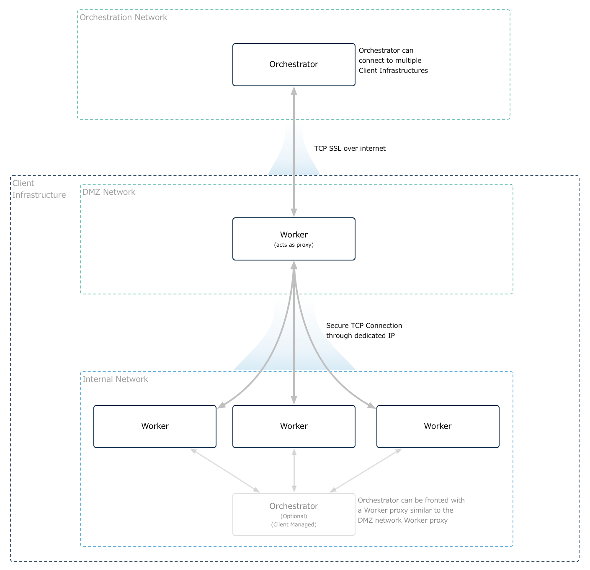
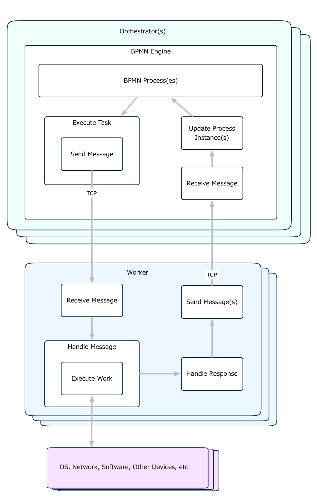
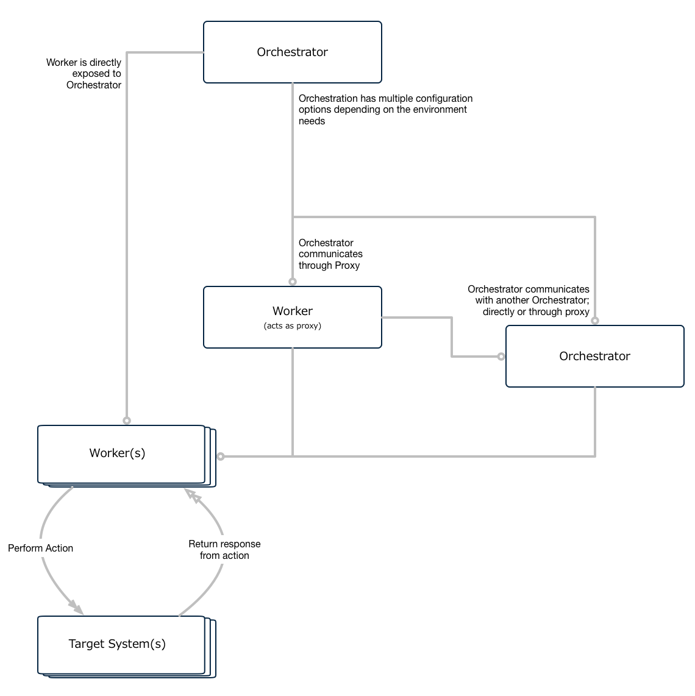

# OpenC2 Orchestrator

Also see: [OpenC2-Worker](https://github.com/StephenOTT/OpenC2-Worker)

## OpenC2 Orchestrator with Worker

## OpenC2 Orchestrator with Worker using a proxy network to limit internal network exposure

## OpenC2 Orchestrator/Worker Message Flow

## OpenC2 Orchestrator/Worker Multiple Configuration Options

# Deploy

`mvn spring-boot:run -f pom.xml`